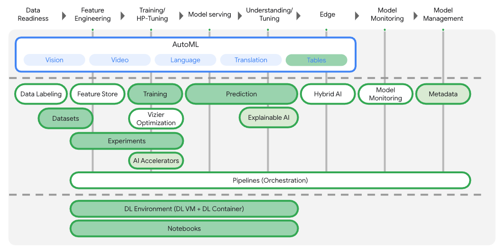

# Vertex AI Labs
---

**Hands-on labs introducing GCP Vertex AI features**

These labs introduce following components of Vertex AI

- Vertex Notebooks
- Vertex AI Training
    - Using pre-built and custom containers
    - Hyperparameter tuning
    - Distributed Training
- Vertex AI Predictions
    - using pre-built and custom containers
- Vertex Tensorboard
- Vertex ML Metadata




## Environment Setup

The following section describes requirements for setting up a GCP environment required for the workshop. Note that we have provided example [Terraform](https://www.terraform.io/) scripts to automate the process. You can find the scripts and the instructions in the `00-env-setup` folder. These are prerequisites for running the labs.

### GCP Project

Each participant should have their own GCP project (through Qwiklabs) with project owner permissions to complete the setup steps.

The setup performs following asks

 1. Activate Google Cloud APIs required for the labs.
 2. Create service accounts required for running the labs.
 3. Create Google Cloud Storage bucket in the region configured (we will be using `us-central1`)
 4. Create a Vertex Notebooks instance to provision a managed JupyterLab notebook instance.
 5. Create a Vertex Tensorboard instance to monitor the experiments run as part of the lab.

---

Please navigate to [00-env-setup](./00-env-setup/README.md) to setup the environment.

---

Following are the details of the setup to run the labs:

### Cloud APIs

The following APIs need to be enabled in the project:

- compute.googleapis.com
- iam.googleapis.com
- container.googleapis.com
- artifactregistry.googleapis.com
- cloudresourcemanager.googleapis.com
- cloudtrace.googleapis.com
- iamcredentials.googleapis.com
- monitoring.googleapis.com
- logging.googleapis.com
- notebooks.googleapis.com
- aiplatform.googleapis.com
- dataflow.googleapis.com
- bigquery.googleapis.com
- cloudbuild.googleapis.com
- bigquerydatatransfer.googleapis.com

### GCP Region

Note that some services used during the notebook are only available in a limited number of regions. We recommend using `us-central1`.

### Service accounts

Two service accounts must be created in the project.

#### Vertex AI training service account

This account will be used by Vertex Training service. The account needs the following permissions:

- storage.admin
- aiplatform.user
- bigquery.admin

The account email should be 

`training-sa@{PROJECT_ID}.iam.gserviceaccount.com`

#### Vertex AI pipelines service account

This account will be used by Vertex Pipelines service. The account needs the following permissions:

- storage.admin
- aiplatform.user
- bigquery.admin

The account email should be 

`pipelines-sa@{PROJECT_ID}.iam.gserviceaccount.com`

### GCS buckets

Each participant should have their own regional GCS bucket. The bucket should be created in the GCP region that will be used during the workshop. The bucket name should use the following naming convention

`gs://{PREFIX}-bucket`

The goal of the prefix is too avoid conflicts between participants as such it should be unique for each participant. **The prefix should start with a letter and include letters and digits only**

The workshop notebooks assume this naming convention.


### Vertex AI Notebook

Each participant should have any instance of Vertex AI Notebook. The instances can be pre-created or can be created during the workshop.

The instance should be configured as follows:

- Machine type: **n1-standard-4**
- Optionally GPUs can be added to the machine configuration if participants want to experiment with GPUs
- Image family: **tf-2-4-cpu** or **tf-2-4-cu110** (if using GPUs)
- Configured with the default compute engine service account

#### Vertex AI Notebook setup

The following setup steps will be performed during the workshop, individually by each of the participants.

In JupyterLab, open a terminal and:

#####  Install the required Python packages

```
pip install --user google-cloud-aiplatform
pip install --user kfp
pip install --user google-cloud-pipeline-components
pip install --user google-cloud-bigquery-datatransfer
```

##### Vertex Tensorboard instance

Each project will have their own Vertex Tensorboard instance created (by the script) in the region configured.

You can get the Tensorboard instance names at any time by listing Tensorboards in the project

```
gcloud beta ai tensorboards list \
  --project $PROJECT --region $REGION
```

##### Clone this repo
```
git clone https://github.com/RajeshThallam/vertex-ai-labs
```


## References:

- https://github.com/jarokaz/vertex-ai-workshop/
